# Adaptive Learning Platform (ALP) – Scalable Frontend Architecture

> **Version:** 1.0  
> **Date:** January 6, 2026  
> **Framework:** Next.js 14+ (App Router) with TypeScript

---

## Executive Summary

This document outlines a **scalable, modular frontend architecture** for the Adaptive Learning Platform (ALP). The existing exam generation feature becomes one module within a larger ecosystem designed to support:

- **Concept-based adaptive learning** for K-12 students
- **Progress tracking & analytics**
- **Future expansions** (gamification, collaborative tools, more subjects)

The architecture follows modern best practices: feature-based modularity, centralized state management, accessibility-first design, and performance optimization.

---

## 1. System Context & Platform Overview

### 1.1 High-Level Architecture


### 1.2 Key Entities (From API)

| Entity      | Description                                                 |
|-------------|-------------------------------------------------------------|
| **Subject** | Top-level curriculum area (e.g., "Grade 7 Science")         |
| **Lesson**  | A collection of related concepts within a subject           |
| **Concept** | The smallest unit of learning – displayed via learning flow |

### 1.3 Learning Flow Stages

Each concept follows a **5-stage learning flow**:

```mermaid
flowchart LR
    Hook["🪝 Hook"] --> Dose["📚 Dose"]
    Dose --> Experiment["🧪 Experiment"]
    Experiment --> Why["🤔 Why"]
    Why --> Exit["🏁 Exit Challenge"]
    
    Experiment -.-> |On Failure| Adaptive["♻️ Adaptive Support"]
    Adaptive -.-> Experiment
```



> [!IMPORTANT]
> The **backend is the single source of truth** for all learning logic. The frontend only displays what the backend provides via the `adaptive` object.

---

## 2. Scalable Folder Structure

### 2.1 Proposed Directory Layout

```
frontend/
├── app/                          # Next.js App Router pages
│   ├── (auth)/                   # Auth route group (login, signup)
│   │   ├── login/
│   │   └── signup/
│   ├── (dashboard)/              # Authenticated routes
│   │   ├── layout.tsx            # Shared dashboard layout
│   │   ├── page.tsx              # Dashboard home
│   │   ├── learn/                # ALP Learning module
│   │   │   ├── page.tsx          # Subject browser
│   │   │   ├── [subjectId]/
│   │   │   │   ├── page.tsx      # Lesson list
│   │   │   │   └── [lessonId]/
│   │   │   │       ├── page.tsx  # Concept list
│   │   │   │       └── [conceptId]/
│   │   │   │           └── page.tsx  # Learning session
│   │   ├── exam-generator/       # Existing exam gen feature
│   │   │   ├── page.tsx
│   │   │   └── history/
│   │   ├── progress/             # Progress tracking (future)
│   │   └── settings/
│   ├── globals.css
│   └── layout.tsx                # Root layout
│
├── components/                   # Shared UI components
│   ├── ui/                       # Primitive UI elements
│   │   ├── Button.tsx
│   │   ├── Card.tsx
│   │   ├── Input.tsx
│   │   ├── Modal.tsx
│   │   ├── Select.tsx
│   │   ├── Skeleton.tsx
│   │   ├── Toast.tsx
│   │   └── index.ts
│   ├── layout/                   # Layout components
│   │   ├── Header.tsx
│   │   ├── Footer.tsx
│   │   ├── Sidebar.tsx
│   │   └── PageContainer.tsx
│   └── shared/                   # Feature-agnostic shared components
│       ├── LoadingOverlay.tsx
│       ├── ErrorBoundary.tsx
│       └── ProtectedRoute.tsx
│
├── features/                     # Feature modules (domain logic)
│   ├── auth/
│   │   ├── components/
│   │   │   ├── LoginForm.tsx
│   │   │   └── SignupForm.tsx
│   │   ├── hooks/
│   │   │   └── useAuth.ts
│   │   └── AuthProvider.tsx
│   │
│   ├── curriculum/               # Curriculum browsing
│   │   ├── components/
│   │   │   ├── SubjectCard.tsx
│   │   │   ├── LessonList.tsx
│   │   │   └── ConceptList.tsx
│   │   ├── hooks/
│   │   │   └── useCurriculum.ts
│   │   └── types.ts
│   │
│   ├── learning/                 # Core learning runtime
│   │   ├── components/
│   │   │   ├── LearningSession.tsx
│   │   │   ├── HookSection.tsx
│   │   │   ├── DoseSection.tsx
│   │   │   ├── ExperimentSection.tsx
│   │   │   ├── WhySection.tsx
│   │   │   ├── ExitChallenge.tsx
│   │   │   ├── AdaptiveMessage.tsx
│   │   │   └── CelebrationScreen.tsx
│   │   ├── hooks/
│   │   │   └── useLearning.ts
│   │   └── types.ts
│   │
│   ├── exam-generator/           # Existing exam feature
│   │   ├── components/
│   │   │   ├── GenerationForm.tsx
│   │   │   ├── QuestionCard.tsx
│   │   │   └── QuestionList.tsx
│   │   ├── hooks/
│   │   └── types.ts
│   │
│   └── progress/                 # Future: Progress tracking
│       ├── components/
│       ├── hooks/
│       └── types.ts
│
├── lib/                          # Utilities & core infrastructure
│   ├── api/
│   │   ├── client.ts             # Base API client with auth
│   │   ├── curriculum.ts         # Curriculum API functions
│   │   ├── learning.ts           # Learning runtime API
│   │   └── exam.ts               # Exam generator API
│   ├── firebase/
│   │   └── config.ts             # Firebase initialization
│   ├── store/                    # Global state management
│   │   ├── useAuthStore.ts
│   │   ├── useLearningStore.ts
│   │   └── useUIStore.ts
│   ├── utils/
│   │   ├── arabicNormalizer.ts
│   │   ├── gradeUtils.ts
│   │   └── formatters.ts
│   └── types/
│       ├── api.ts                # API response types
│       └── common.ts             # Shared types
│
├── hooks/                        # Global custom hooks
│   ├── useMediaQuery.ts
│   ├── useLocalStorage.ts
│   └── useDebounce.ts
│
├── styles/                       # Global styles
│   ├── variables.css             # CSS custom properties
│   └── animations.css
│
├── public/
│   ├── icons/
│   └── images/
│
└── config/
    ├── subjects.config.json      # Subject/grade configuration
    └── constants.ts              # App-wide constants
```

### 2.2 Architecture Principles

| Principle                | Implementation                                              |
|--------------------------|-------------------------------------------------------------|
| **Feature-based modules**| Each feature (learning, exam-gen) is self-contained         |
| **Separation of concerns**| UI components, hooks, and types in separate directories    |
| **Shared UI library**    | Primitive components in `components/ui/`                    |
| **Centralized API layer**| All API calls go through `lib/api/`                         |
| **Type safety**          | TypeScript interfaces for all API responses                 |

---

## 3. Component Architecture

### 3.1 Component Hierarchy


### 3.2 Learning Session Component Breakdown


### 3.3 Component Design Guidelines

| Guideline                      | Details                                                    |
|--------------------------------|------------------------------------------------------------|
| **Atomic design**              | Build complex UIs from primitive `ui/` components          |
| **Props over state**           | Pass data via props; use hooks for fetching                |
| **Server Components**          | Use for data fetching where possible                       |
| **Client Components**          | Mark with `'use client'` only when needed (interactivity)  |
| **Skeleton loaders**           | Every async component should have loading states           |
| **Error boundaries**           | Wrap feature modules in error boundaries                   |

---

## 4. State Management Strategy

### 4.1 State Categories


### 4.2 Recommended Libraries

| Category       | Library          | Purpose                                          |
|----------------|------------------|--------------------------------------------------|
| Server state   | **TanStack Query**| Caching, refetching, loading states for API data|
| Client state   | **Zustand**       | Lightweight global state (auth, UI preferences) |
| Form state     | **React Hook Form**| Form validation and handling                   |

### 4.3 Store Examples

```typescript
// lib/store/useAuthStore.ts
import { create } from 'zustand';
import { User } from 'firebase/auth';

interface AuthState {
  user: User | null;
  role: 'student' | 'admin' | null;
  isLoading: boolean;
  setUser: (user: User | null, role?: string) => void;
  logout: () => void;
}

export const useAuthStore = create<AuthState>((set) => ({
  user: null,
  role: null,
  isLoading: true,
  setUser: (user, role) => set({ 
    user, 
    role: (role as 'student' | 'admin') || 'student',
    isLoading: false 
  }),
  logout: () => set({ user: null, role: null }),
}));
```

```typescript
// lib/store/useLearningStore.ts
import { create } from 'zustand';
import { LearningSession } from '@/lib/types/api';

interface LearningState {
  currentSession: LearningSession | null;
  currentStep: 'hook' | 'dose' | 'experiment' | 'why' | 'exit_challenge';
  setSession: (session: LearningSession) => void;
  setStep: (step: LearningState['currentStep']) => void;
  clearSession: () => void;
}

export const useLearningStore = create<LearningState>((set) => ({
  currentSession: null,
  currentStep: 'hook',
  setSession: (session) => set({ currentSession: session, currentStep: 'hook' }),
  setStep: (step) => set({ currentStep: step }),
  clearSession: () => set({ currentSession: null, currentStep: 'hook' }),
}));
```

---

## 5. Feature Module Breakdown

### 5.1 Feature Modules Overview

| Feature Module     | Status     | Description                                       |
|--------------------|------------|---------------------------------------------------|
| **exam-generator** | ✅ Existing | Generate practice exams from indexed content      |
| **learning**       | 🆕 New     | Core ALP: concept-based adaptive learning         |
| **curriculum**     | 🆕 New     | Browse subjects, lessons, concepts                |
| **auth**           | 🔄 Refactor| Firebase auth with role-based access              |
| **progress**       | 📋 Future  | Student progress tracking and analytics           |
| **gamification**   | 📋 Future  | XP, badges, leaderboards                          |

### 5.2 Learning Feature Details

```
features/learning/
├── components/
│   ├── LearningSession.tsx      # Main orchestrator component
│   ├── HookSection.tsx          # Displays hook (question/story/fact)
│   ├── DoseSection.tsx          # Main content with optional media
│   ├── ExperimentSection.tsx    # Interactive quiz (MCQ, drag-drop)
│   ├── WhySection.tsx           # Reflection prompt
│   ├── ExitChallenge.tsx        # Final assessment
│   ├── AdaptiveMessage.tsx      # Simplified explanation/analogy
│   ├── CelebrationScreen.tsx    # Success animation + XP
│   └── StepIndicator.tsx        # Progress through 5 stages
├── hooks/
│   ├── useLearning.ts           # API calls: start, fail, complete
│   └── useLearningProgress.ts   # Track local step progression
├── types.ts                     # TypeScript interfaces
└── utils/
    └── stepNavigation.ts        # Step transition logic
```

### 5.3 Migration Path for Existing Exam Generator

```
Current Structure:                    New Structure:
components/                           features/exam-generator/
├── GenerationForm.tsx       →        ├── components/
├── QuestionCard.tsx         →        │   ├── GenerationForm.tsx
├── QuestionList.tsx         →        │   ├── QuestionCard.tsx
└── ...                               │   └── QuestionList.tsx
                                      ├── hooks/
lib/api.ts                   →        │   └── useExamGeneration.ts
                                      └── types.ts
```

---

## 6. Routing Architecture

### 6.1 Route Structure

```typescript
// Route hierarchy
/                           → Landing page (public)
├── /login                  → Auth: Login
├── /signup                 → Auth: Signup
│
└── / (dashboard)           → Protected routes
    ├── /                   → Dashboard home
    │
    ├── /learn              → Subject browser
    │   └── /[subjectId]    → Lesson list
    │       └── /[lessonId] → Concept list
    │           └── /[conceptId] → Learning session
    │
    ├── /exam-generator     → Exam generation
    │   ├── /generate       → Generate new exam
    │   └── /history        → View past exams
    │
    ├── /progress           → Progress tracking (future)
    └── /settings           → User settings
```

### 6.2 Route Protection

```tsx
// components/shared/ProtectedRoute.tsx
'use client';

import { useEffect } from 'react';
import { useRouter } from 'next/navigation';
import { useAuthStore } from '@/lib/store/useAuthStore';

interface ProtectedRouteProps {
  children: React.ReactNode;
  requiredRole?: 'student' | 'admin';
}

export function ProtectedRoute({ children, requiredRole }: ProtectedRouteProps) {
  const { user, role, isLoading } = useAuthStore();
  const router = useRouter();

  useEffect(() => {
    if (!isLoading && !user) {
      router.push('/login?redirect=' + window.location.pathname);
    }
    
    if (!isLoading && requiredRole === 'admin' && role !== 'admin') {
      router.push('/unauthorized');
    }
  }, [user, role, isLoading, requiredRole, router]);

  if (isLoading) return <LoadingSkeleton />;
  if (!user) return null;
  
  return <>{children}</>;
}
```

---

## 7. API Integration Layer

### 7.1 API Client Architecture


### 7.2 Base API Client

```typescript
// lib/api/client.ts
import { auth } from '@/lib/firebase/config';

const API_BASE_URL = process.env.NEXT_PUBLIC_API_URL!;

export class ApiError extends Error {
  constructor(
    public status: number,
    public detail: string,
    public retryAfter?: string
  ) {
    super(detail);
    this.name = 'ApiError';
  }
}

type RequestOptions = RequestInit & { skipAuth?: boolean };

export async function apiClient<T>(
  endpoint: string,
  options: RequestOptions = {}
): Promise<T> {
  const { skipAuth, ...fetchOptions } = options;
  
  const headers: HeadersInit = {
    'Content-Type': 'application/json',
    ...fetchOptions.headers,
  };

  // Add auth token for protected endpoints
  if (!skipAuth) {
    const user = auth.currentUser;
    if (!user) {
      throw new ApiError(401, 'Not authenticated');
    }
    const token = await user.getIdToken(true);
    headers['Authorization'] = `Bearer ${token}`;
  }

  const response = await fetch(`${API_BASE_URL}${endpoint}`, {
    ...fetchOptions,
    headers,
  });

  if (!response.ok) {
    const error = await response.json().catch(() => ({ detail: 'Unknown error' }));
    
    if (response.status === 429) {
      throw new ApiError(429, error.message, error.retry_after);
    }
    
    throw new ApiError(response.status, error.detail);
  }

  return response.json();
}
```

### 7.3 Feature-Specific API Modules

```typescript
// lib/api/curriculum.ts
import { apiClient } from './client';
import { Subject, Lesson, Concept } from '@/lib/types/api';

export const curriculumApi = {
  getSubjects: () => 
    apiClient<Subject[]>('/curriculum/subjects'),
    
  getLessons: (subjectId: string) => 
    apiClient<Lesson[]>(`/curriculum/subjects/${subjectId}/lessons`),
    
  getConcepts: (lessonId: string) => 
    apiClient<Concept[]>(`/curriculum/lessons/${lessonId}/concepts`),
};

// lib/api/learning.ts
import { apiClient } from './client';
import { LearningSession } from '@/lib/types/api';

export const learningApi = {
  startConcept: (conceptId: string) =>
    apiClient<LearningSession>('/runtime/learn/start', {
      method: 'POST',
      body: JSON.stringify({ concept_id: conceptId }),
    }),
    
  recordFailure: (conceptId: string, step: string) =>
    apiClient<{ status: string }>('/runtime/learn/fail', {
      method: 'POST',
      body: JSON.stringify({ concept_id: conceptId, step }),
    }),
    
  completeConcept: (conceptId: string) =>
    apiClient<{ status: string }>('/runtime/learn/complete', {
      method: 'POST',
      body: JSON.stringify({ concept_id: conceptId }),
    }),
};
```

---

## 8. Accessibility & Performance

### 8.1 Accessibility Requirements

| Category             | Requirement                                                 |
|----------------------|-------------------------------------------------------------|
| **Keyboard navigation** | All interactive elements focusable and operable           |
| **Screen readers**   | Semantic HTML, ARIA labels for custom components            |
| **Color contrast**   | WCAG 2.1 AA minimum (4.5:1 for text)                        |
| **Focus indicators** | Visible focus rings on all interactive elements             |
| **RTL support**      | Arabic content requires right-to-left layout                |
| **Reduced motion**   | Respect `prefers-reduced-motion` for animations             |

### 8.2 RTL Arabic Support

```css
/* styles/variables.css */
:root {
  --direction: ltr;
}

[dir="rtl"] {
  --direction: rtl;
}

.content {
  direction: var(--direction);
  text-align: start;
}
```

```tsx
// Example: Arabic content detection
const isArabic = (text: string) => /[\u0600-\u06FF]/.test(text);

<p dir={isArabic(content) ? 'rtl' : 'ltr'}>{content}</p>
```

### 8.3 Performance Optimization

| Technique                  | Implementation                                          |
|----------------------------|---------------------------------------------------------|
| **Code splitting**         | Feature-based dynamic imports                           |
| **Image optimization**     | Next.js `Image` component with lazy loading             |
| **Bundle analysis**        | Regular bundle size monitoring                          |
| **Caching**                | TanStack Query with stale-while-revalidate              |
| **Prefetching**            | Next.js `Link` component prefetches on hover            |
| **Virtual scrolling**      | For long concept lists (react-window)                   |

```typescript
// Dynamic import example
const LearningSession = dynamic(
  () => import('@/features/learning/components/LearningSession'),
  { loading: () => <LearningSessionSkeleton /> }
);
```

### 8.4 Error Handling Strategy


---

## 9. Theme & Design System

### 9.1 Dark/Light Mode

```typescript
// lib/store/useUIStore.ts
interface UIState {
  theme: 'light' | 'dark' | 'system';
  setTheme: (theme: UIState['theme']) => void;
}

export const useUIStore = create<UIState>()(
  persist(
    (set) => ({
      theme: 'system',
      setTheme: (theme) => set({ theme }),
    }),
    { name: 'ui-preferences' }
  )
);
```

### 9.2 CSS Custom Properties

```css
/* styles/variables.css */
:root {
  /* Colors - Light */
  --color-bg-primary: #ffffff;
  --color-bg-secondary: #f8f9fa;
  --color-text-primary: #1a1a2e;
  --color-text-secondary: #6c757d;
  --color-accent: #4f46e5;
  --color-success: #10b981;
  --color-error: #ef4444;
  
  /* Spacing */
  --space-xs: 0.25rem;
  --space-sm: 0.5rem;
  --space-md: 1rem;
  --space-lg: 1.5rem;
  --space-xl: 2rem;
  
  /* Border radius */
  --radius-sm: 0.25rem;
  --radius-md: 0.5rem;
  --radius-lg: 1rem;
  
  /* Shadows */
  --shadow-sm: 0 1px 2px rgba(0, 0, 0, 0.05);
  --shadow-md: 0 4px 6px rgba(0, 0, 0, 0.1);
  --shadow-lg: 0 10px 15px rgba(0, 0, 0, 0.1);
}

[data-theme="dark"] {
  --color-bg-primary: #1a1a2e;
  --color-bg-secondary: #16213e;
  --color-text-primary: #eaeaea;
  --color-text-secondary: #a0a0a0;
}
```

---

## 10. Potential Challenges & Mitigations

### 10.1 Technical Challenges

| Challenge                        | Mitigation Strategy                                     |
|----------------------------------|--------------------------------------------------------|
| **Large dataset handling**       | Pagination, virtual scrolling, React Query caching     |
| **Real-time adaptive updates**   | WebSocket consideration for future; polling for now    |
| **Offline support**              | Service worker caching for critical assets             |
| **Firebase token management**    | Auto-refresh via `getIdToken(true)` before each call   |
| **Arabic RTL layout**            | CSS logical properties, dir attribute on containers    |

### 10.2 Data Privacy (K-12 Students)

| Concern                          | Implementation                                          |
|----------------------------------|--------------------------------------------------------|
| **COPPA compliance**             | Parental consent flow for <13 users                    |
| **Data minimization**            | Only collect necessary learning data                   |
| **Secure storage**               | No PII in localStorage; use secure session storage     |
| **Token handling**               | Let Firebase SDK manage tokens; never store manually   |

---

## 11. Implementation Roadmap

### Phase 1: Foundation (Week 1-2)
- [ ] Scaffold new folder structure
- [ ] Create shared UI component library (`components/ui/`)
- [ ] Set up Zustand stores for auth and UI
- [ ] Implement TanStack Query configuration
- [ ] Refactor existing exam-generator into feature module

### Phase 2: Authentication (Week 2-3)
- [ ] Build `AuthProvider` with Firebase
- [ ] Implement `ProtectedRoute` wrapper
- [ ] Create login/signup pages
- [ ] Role-based route protection

### Phase 3: Curriculum Browsing (Week 3-4)
- [ ] Subject browser page
- [ ] Lesson list component
- [ ] Concept list component
- [ ] Navigation with breadcrumbs

### Phase 4: Learning Runtime (Week 4-6)
- [ ] `LearningSession` orchestrator component
- [ ] All 5 learning stage components
- [ ] Adaptive message display
- [ ] Celebration/completion screen
- [ ] API integration with `useLearning` hook

### Phase 5: Polish & Testing (Week 6-7)
- [ ] Accessibility audit (a11y)
- [ ] RTL Arabic layout testing
- [ ] Performance optimization
- [ ] Error boundary implementation
- [ ] End-to-end testing

### Future Phases
- **Progress Tracking**: Dashboard with learning analytics
- **Gamification**: XP system, badges, streaks
- **Collaborative Tools**: Study groups, shared notes

---

## 12. Diagram Tools Recommendation

For creating and maintaining architecture diagrams:

| Tool              | Use Case                                                 |
|-------------------|----------------------------------------------------------|
| **Mermaid**       | Inline diagrams in markdown (flowcharts, sequence)       |
| **Draw.io**       | Complex system architecture diagrams                     |
| **Excalidraw**    | Whiteboard-style sketches                                |
| **Figma**         | UI mockups and design system documentation               |

---

## Quick Reference

### API Endpoints Summary

| Purpose               | Method | Endpoint                                | Auth |
|-----------------------|--------|-----------------------------------------|------|
| List subjects         | GET    | `/curriculum/subjects`                  | ✅    |
| List lessons          | GET    | `/curriculum/subjects/{id}/lessons`     | ✅    |
| List concepts         | GET    | `/curriculum/lessons/{id}/concepts`     | ✅    |
| Start learning        | POST   | `/runtime/learn/start`                  | ✅    |
| Record failure        | POST   | `/runtime/learn/fail`                   | ✅    |
| Complete concept      | POST   | `/runtime/learn/complete`               | ✅    |

### Key Files Quick Reference

| Concern               | File Location                                |
|-----------------------|----------------------------------------------|
| API client            | `lib/api/client.ts`                          |
| Auth store            | `lib/store/useAuthStore.ts`                  |
| Learning hook         | `features/learning/hooks/useLearning.ts`     |
| Learning session UI   | `features/learning/components/LearningSession.tsx` |
| Shared UI components  | `components/ui/`                             |

---

*End of Architecture Document*
